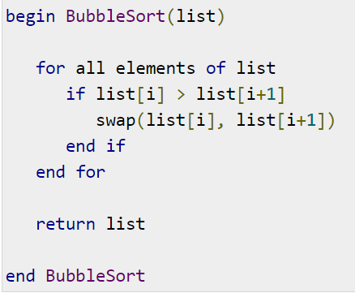
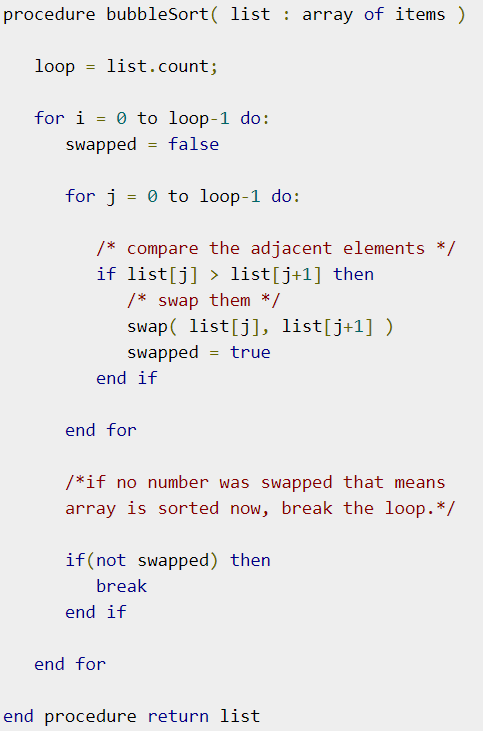
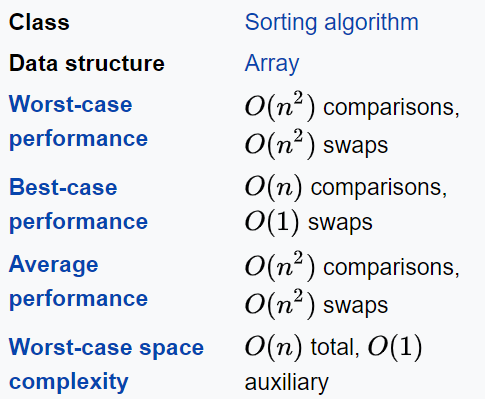
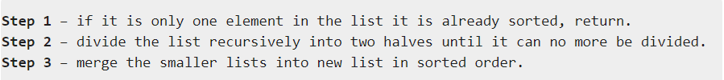
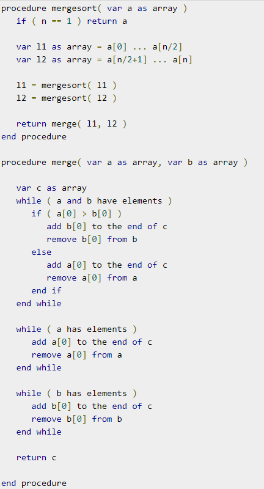
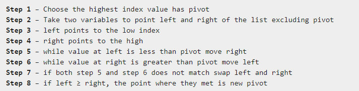
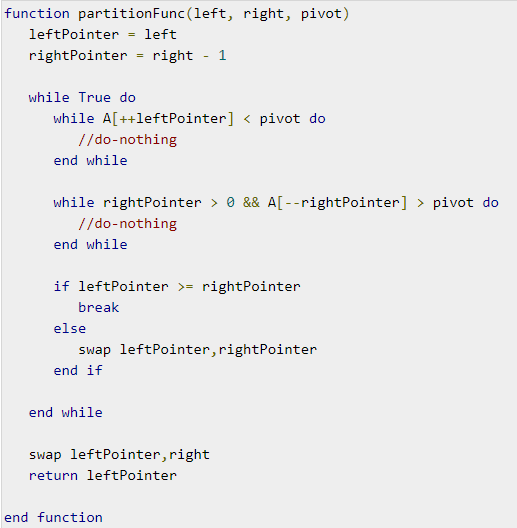
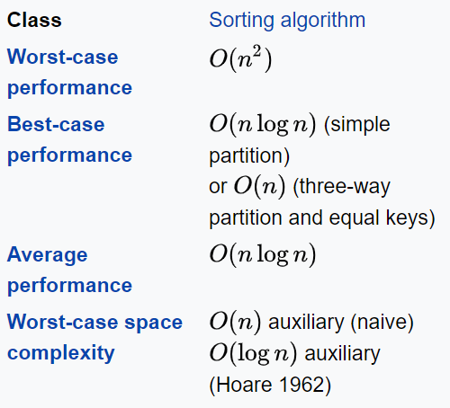

# Java Sorting App

This is an example of a simple sorting app. The program provides the user with the ability to generate an array of a given length, then choose the method in which it should be sorted.

### Table of Contents
- ######  BubbleSort
- ######  MergeSort
- ######  QuickSort

## BubbleSort
BubbleSort will sort an array by 'floating' higher values towards the end of the array, allowing lower values to 'sink' to the start.

__Algorithm__

__PseaudoCode__

__Demonstration__

__Space and Time Complexity__

###### Wikipedia Link - more info
https://en.wikipedia.org/wiki/Bubble_sort

## MergeSort
MergeSort implements a 'divide and conquer' like algorithm. It breaks an array into ever smaller arrays, before merging them back together, sorting them as they go. Finally we end up with one array again, all sorted.

__Algorithm__

__PseaudoCode__

__Demonstration__

__Space and Time Complexity__

###### Wikipedia Link - more info
https://en.wikipedia.org/wiki/Merge_sort

## QuickSort
Quicksort works by picking a pivot in the array, the elements of the array are then sorted based on whether they are higher or lower than the pivot, left for low, right for high. The pivot then moves based on the values left and right of it, sorting based on higher/lower at every pivot point.

__Algorithm__

__PseaudoCode__

__Demonstration__

__Space and Time Complexity__

###### Wikipedia Link - more info
https://en.wikipedia.org/wiki/Quick_sort