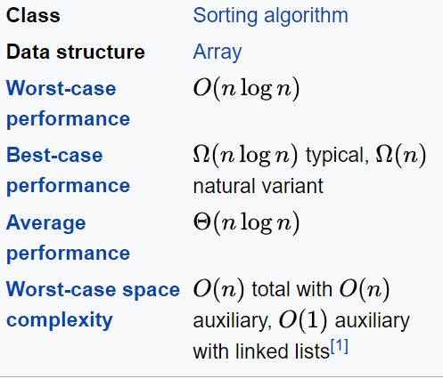

# Java Sorting App

This is an example of a simple sorting app. The program provides the user with the ability to generate an array of a given length, then choose the method in which it should be sorted. 
Now with generic typing support. Arrays of any Object with a compareTo() method can be sorted using all algortihms (except BinarySearchTree, that is currently a work in progress).

Future extensions:
- Full BST implementation
- Find a suitable hash function to allow the above
- GUI -> JavaFX
- More types of objects and comparison methods

### Table of Contents
- ######  BubbleSort
- ######  MergeSort
- ######  QuickSort
- ######  InsertionSort
- ######  BinarySortTree and inOrder traversal

## BubbleSort
BubbleSort will sort an array by 'floating' higher values towards the end of the array, allowing lower values to 'sink' to the start.

__Algorithm__

__PseaudoCode__

__Demonstration__

__Space and Time Complexity__

###### Wikipedia Link - more info
https://en.wikipedia.org/wiki/Bubble_sort

## MergeSort
MergeSort implements a 'divide and conquer' like algorithm. It breaks an array into ever smaller arrays, before merging them back together, sorting them as they go. Finally we end up with one array again, all sorted.

__Algorithm__

__PseaudoCode__

__Demonstration__

__Space and Time Complexity__

###### Wikipedia Link - more info
https://en.wikipedia.org/wiki/Merge_sort

## QuickSort
Quicksort works by picking a pivot in the array, the elements of the array are then sorted based on whether they are higher or lower than the pivot, left for low, right for high. The pivot then moves based on the values left and right of it, sorting based on higher/lower at every pivot point.

__Algorithm__

__PseaudoCode__

__Demonstration__

__Space and Time Complexity__

###### Wikipedia Link - more info
https://en.wikipedia.org/wiki/Quick_sort

## InsertionSort
Insertion sort works by inserting each element one at a time. It will iterate through the array, selecting elements. Each element will then be compared to the rest of the array and placed in its lowest index valid position. 

__Algorithm__

__PseaudoCode__

__Demonstration__

__Space and Time Complexity__

###### Wikipedia Link - more info
https://en.wikipedia.org/wiki/Insertion_sort

## BinarySearchTree and inOrder traversal
A binary search tree is a data structure consisting of nodes. Each node has a left and right node. The general rules for a binary search tree can be found below.
Once the binary search tree is constructed, we can perform an inOrder traversal to build a sorted array from the search tree.

__Binary Search Tree Properties__

__Binary Search Tree Insertion Algorithm__

__inOrder traversal Algorithm__

__Demonstration__

__Space and Time Complexity__

###### Wikipedia Links - more info
https://en.wikipedia.org/wiki/B-tree
